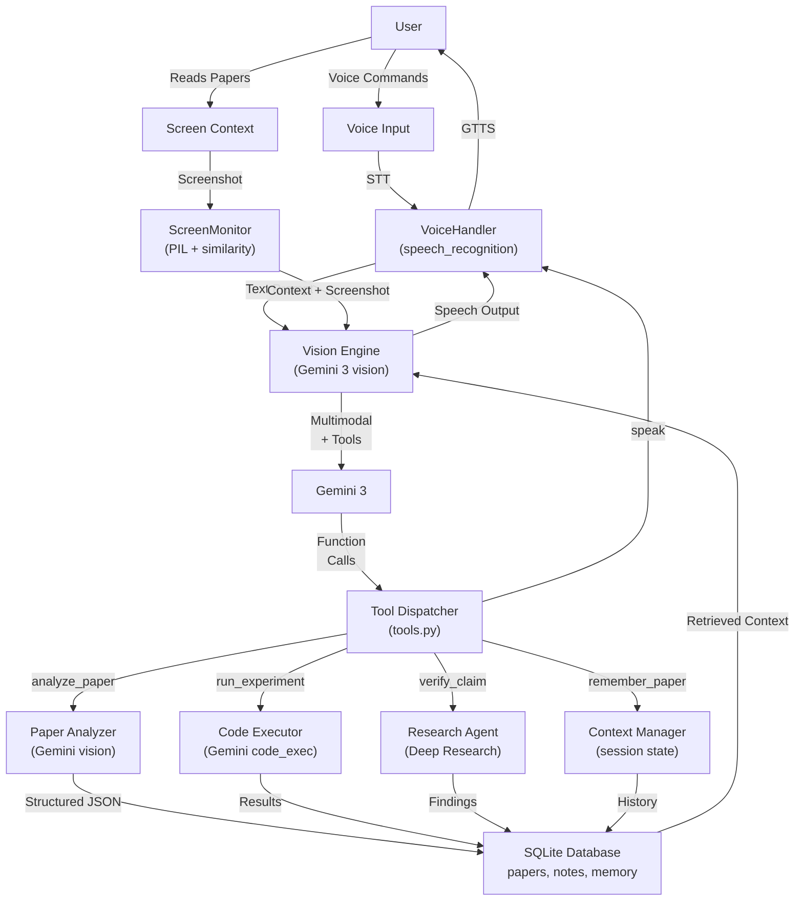

```mermaid
graph TB
    User["User"]
    Voice["Voice Input"]
    Screen["Screen Context"]
    
    User -->|Voice Commands| Voice
    User -->|Reads Papers| Screen
    
    Voice -->|STT| VoiceHandler["VoiceHandler<br/>(speech_recognition)"]
    Screen -->|Screenshot| ScreenMonitor["ScreenMonitor<br/>(PIL + similarity)"]
    
    VoiceHandler -->|Text Prompt| VisionEngine["Vision Engine<br/>(Gemini 3 vision)"]
    ScreenMonitor -->|Context + Screenshot| VisionEngine
    
    VisionEngine -->|Multimodal<br/>+ Tools| GeminiAPI["Gemini 3"]
    
    GeminiAPI -->|Function<br/>Calls| ToolDispatcher["Tool Dispatcher<br/>(tools.py)"]
    
    ToolDispatcher -->|analyze_paper| PaperAnalyzer["Paper Analyzer<br/>(Gemini vision)"]
    ToolDispatcher -->|run_experiment| CodeExecutor["Code Executor<br/>(Gemini code_exec)"]
    ToolDispatcher -->|verify_claim| ResearchAgent["Research Agent<br/>(Deep Research)"]
    ToolDispatcher -->|remember_paper| ContextMgr["Context Manager<br/>(session state)"]
    ToolDispatcher -->|speak| VoiceHandler
    
    PaperAnalyzer -->|Structured JSON| DB["SQLite Database<br/>papers, notes, memory"]
    CodeExecutor -->|Results| DB
    ResearchAgent -->|Findings| DB
    ContextMgr -->|History| DB
    
    DB -->|Retrieved Context| VisionEngine
    
    VisionEngine -->|Speech Output| VoiceHandler
    VoiceHandler -->|GTTS| User
    
```